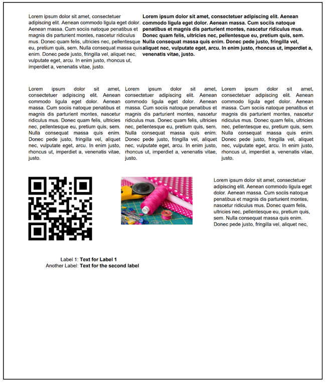

A first example
===============

:ref:`See Example 26 <Sample 26>`

The following example output shows the result of a dynamic report. I have defined the widths of the parts in
percent of the surrounding rectangles, which in this case is the printable width of the paper.
The first two text blocks have a width of 40% and 60% with no padding. Then follows a row with three
text blocks with 33.3% width each and a padding of 4mm. Then follows some other content types:

