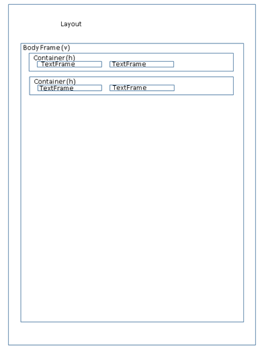

Basic Concept
=============

The PDFReport offers classes, attributes and functions to create reports in a straightforward way.
You do not have to take care about line and page breaks or about positions of content.

The calculation of the sizes and positions of text and other elements on the report is part of the PDFReport.
As a user of the classes, you can control the output by using the different frame types and their attributes and functions.

The library uses the composite pattern to create the report structure. Each element needs a parent to which it will be added.

Frames
------

Everything on a report is inside a frame i.e., a rectangular region on the paper. A frame has an upper left
corner and a lower right corner. The library will calculate these values based on the definitions of the frame
and/or the content. You can define the width in millimeters or in percent of the surrounding frame or you leave it to
the PDFReport to calculate them.

Some frames (container frames) may contain other frames. The sizes of the inner frames define the size of the
surrounding frame, whereas the outer frame may limit the size of the inner frames.

The whole report has internally a tree structure of different nested frames. During the output, the library will
process the tree recursively.

As you can see the basic idea is quite simple but because the structure is recursive it can get complex.

Example of report structure
---------------------------

The following figure shows the structure of a simple report. Firstly, there is the page layout (page format and
page margins) which defines the size of the pager and the printable area of the report body. The body is a vertically
organized container and contains two horizontal containers. Each of them contains then two text frames.

The border lines serve only for a visualization of the structure. If you do not define any margins or paddings the
frames have no distance between them as the image may imply.

Simple frame types
------------------

These frame types have content (e.g., some text, an image et cetera) and their size and position can be calculated
directly in one step.

   •	LineFrame: A simple line on the report. It can have different length, extents, colors, and formats
   •	TextFrame: A frame with text and a text style.
   •	ImageFrame: A picture
   •	TableFrame: A feature rich table frame with columns and rows of data
   •	BreakFrame: A manual page break which can change the page format from the next page on.
   •	BarcodeFrame: A barcode (e.g., a QR code)

Container frame types
---------------------

A container frame is a special kind of frame which can hold a list of other frames. The library processes the elements
of a container frame as a unit to calculate the size and position of the container frame. A container can be organized
horizontally or vertically.

   •	SerialFrame: A container frame to hold a list of other frames. They can be organized horizontally or vertically.
   •	BoxFrame: A rectangular region on the report which can hold one other frame. It can have a border,
        a background color, and paddings to format its content
   •	PageFrame: A container frame that the library prints on every page or only on certain pages.
   •	PositionFrame: A frame that the library prints on an exact position on the paper. It can overlay other frames.

I will describe all frame types in detail later in this document.

General attributes for frame types
----------------------------------

Every frame type has a list of attributes which define its individual character. The following list shows a few
attributes which may be used by multiple frame types.

   •	Margins (left, top, right and bottom).
   •	Flags if the frame may use the full width or height of the surrounding frame.
   •	Alignment (horizontal and vertical).
   •	Maximal sizes
   •	Flag if a frame should keep all content on one page.
   •	Background color
   •	Lines around a box
   •	Directions (horizontal or vertical)

All these attributes I will describe in detail later in this document when discussing the different frame types.

