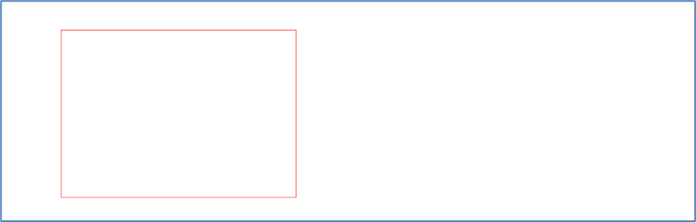
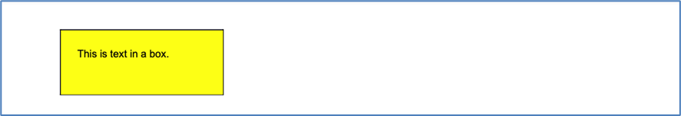
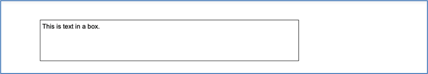
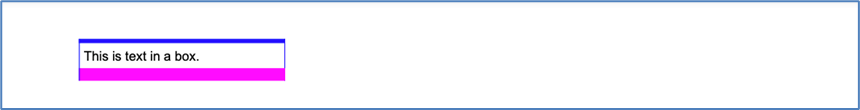

Class BoxFrame
==============

:ref:`See Example 20 <Sample 20>`

A *BoxFrame* is a special kind of *ContainerFrame*. It is derived from the class *ContainerFrame*, but it can manage
only one frame in the container. This limitation is not very restricting because you can add a container frame
which can hold many other frames.

A *BoxFrame* can have a border and a background color. You can specify a width and/or a height that the box may use
in the report. The frame can have different paddings on all four sides. A padding reduces the possible size of the
content in the box by adding some whitespace.

The width and the height can be set independently or not at all. If you do not set the width, then the content will
define the width of the *BoxFrame*.

You will use *BoxFrame* and *SerialFrame* a lot because they are very flexible objects to control
the layout in a report.

The constructor of a *BoxFrame* has the following parameters

   •	width - can be zero
   •	height - can be zero
   •	border_extent - the extent for a border line (default 0.0)
   •	border_color - default black
   •	background_color - default white

If you create a *BoxFrame* with no parameters in the constructor and you do not add any content to it, nothing
will be printed because this box will not use any space. You have to define a width, or you have to add content
to make a box visible.

The following example creates a red box in the report.

..  code-block:: python

   from PDFReport import *

   box = BoxFrame(body, 70.0, 50.0, 0.1, "#FF0000")

That may look like the following figure.

The background will fill the whole box including the paddings. The next example defines a box with a black border
and a yellow filling. The text will respect a padding of 5mm inside the box.

..  code-block:: python

   from PDFReport import *

   bf = BoxFrame(body, 50.0, 20.0, 0.3)
   bf.setPadding(5.0)
   bf.background = "#FFFF00"

   tf = TextFrame(bf, "This is text in a box.")

This example produces the following output

BoxFrame width in percent
-------------------------

:ref:`See Example 22 <Sample 22>`

You can define the width of a *BoxFrame* in percent of the width of the parent frame. To do that you
have to pass the width as string. You can even mix percent and absolute values as in the following example.

..  code-block:: python

   from PDFReport import *

   bf = BoxFrame(body, "70.0%", 20.0, 0.1)
   bf.setPadding(1.0)

   tf = TextFrame(bf, "This is text in a box.")

The example shows a box frame with 70% of the width of the parent frame and a height of 20mm with a thin black
border. The box gets some example text in a TextFrame as content. The output will look as follows.

Class Border
------------

The *BoxFrame* uses the *Border* class to manage the border around the box. The border contains four different *Pen*
objects for the four sides left, top, right and bottom. Therefore, it is possible to have four different line types
(or no line at all) around a box frame.

You can set the same pen for all four sides or an individual pen for a certain side. The following example sets
the pen for all sides and creates then some special pens for the top and the bottom sides by changing them in the
border object.

..  code-block:: python

   from PDFReport import *

   box = BoxFrame(body, 50.0, 10.0)
   box.border.set_pen(Pen(0.2, "#0000FF"))
   box.border.top_pen.extent = 1.0
   box.border.bottom_pen.extent = 3.0
   box.border.bottom_pen.color = "#FF00FF"

   tf = TextFrame(bf, "This is text in a box.")

The output looks as follows.

