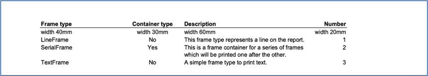

Class TableFrame
================

:ref:`See Example 12 <Sample 12>`

A *TableFrame* is a simple frame type derived from *ReportFrame*. It has a lot of features to create tables in a report.
It contains a sub structure (columns), but it is not a container. The *TableFrame* manages the columns of the table.
You can add columns to the table and specify how the columns will appear on the page.

The library prints a table header automatically (also on every new page), but it can be suppressed if no header
is needed. The header row uses the title of the column as heading, so if you leave the title of a column empty
there is no text in the header for that column. The predefined text style *TABLE_HEADER* will be used to
print the header row.

The width of the table is the sum of the widths of the columns. There are multiple ways to define the widths of
columns and it is possible that the table automatically uses the width of the parent frame. In this case the
library enlarges the columns relative to their original sizes.

The lines in the table can be set individually. You can define a border around the table, horizontal lines
between rows and/or vertical lines between columns. The lines use *Pen* objects and it is possible to print all the
lines with different pens. There are separate pens for the line below the header and above a total row and the other
horizontal lines between rows.

The table manages the data in rows. Each row has an array of *TableCells* for the columns of the table.
It also has a row type which defines the text style that the library uses to print the data of the row.

   •	RowType.HEADER for the header row (text style TABLE_HEADER)
   •	DETAIL for detail rows (text style TABLE_ROW)
   •	SUBTOTAL for subtotal rows (text style TABLE_SUBTOTAL)
   •	TOTAL for total rows (text style TABLE_TOTAL)

There are predefined text styles for the different row types. You can change the text styles as you need them,
or you can create new text styles and set them in the *TableFrame* object.

Class TableColumn
-----------------

Often you do not need to change anything directly in objects of this class because the columns are managed by
the *TableFrame*. But there are some special attributes which are not accessible via the TableFrame (e.g., the right
pen or the paddings). There are getters and setters for the attributes of the class.

   •	title - the title text for the header row
   •	line_break - flag if there is line break after the column
   •	right_pen - the pen for vertical lines right to the column (has no effect for the last column if there is a border around the table)
   •	h_align - horizontal alignment (default left)
   •	v_align - vertical alignment (default top)
   •	padding_left, padding_right, padding_top, padding_bottom - paddings in the cells of the table.

The function to add columns to a table returns a reference to the newly added column. With this reference you can
modify the column. The next example code shows how you can do it. The pen right of the column is set to 0.1mm with
a grey color and there is a padding on the right side of 2mm.

..  code-block:: python

   tcol = TableColumn(table, "Frame type", 40.0)
   tcol.right_pen = Pen(0.1, "#C0C0C0")
   tcol.padding_right = 2.0

The next section shows how to add columns to a table frame and how you can adjust them.

Create a table and its columns
------------------------------

First you have to create an instance of a *TableFrame* object and add that to a container frame (in the example the
main body is the container). Then you can set special attributes of the *TableFrame*.

..  code-block:: python

   from PDFReport import *

   # Add the table to the report body
   table = TableFrame(body);

   # Adjust the table
   table.column_lines = True
   table.inter_row_space = 1.0
   table.border.top_pen.extent = 1.0
   table.border.bottom_pen.extent = 1.0
   table.border.bottom_pen.color = "#0000FF"

In this example the *TableFrame* gets a border line on the top and on the bottom. The lines have an extent of 1mm,
and the top line will be black, and the bottom line will be blue. The library prints vertical lines between columns
and there will be white space of 1mm between the rows.

Here is a list of attributes that you can use for table frames.

   •	column_lines - flag which defines if the library prints vertical lines (default false)
   •	max_header_row_height - maximum height of the header (default 100mm)
   •	max_detail_row_height - maximum height of a detail row (default 100mm)
   •	margin_bottom_subtotal - a margin that will be added on rows of type *total* or *subtotal*
   •	inter_row_space - additional whitespace between rows of data
   •	header_text_style - text style for header rows
   •	detail_row_text_style - text style for detail rows
   •	alternating_row_text_style - text style for detail rows – if this text style is not null then the detail rows will print alternately with the text style for detail rows and this text style.
   •	sub_total_row_text_style - text style for subtotal rows
   •	total_row_text_style - text style for total rows
   •	min_data_rows_fit - minimal number of data rows that must fit on a page before the library adds a page before the table.
   •	border - a border object to draw a border around the table
   •	repeat_header_row - flag if the library prints the header row on every new page
   •	suppress_header_row - flag if the library prints a header row at all
   •	inner_pen_header_bottom - a pen for the line below the header
   •	inner_pen_total_top - a pen for the line above the total row
   •	inner_pen_row - a pen for the lines between detail rows.

After you have defined the table, you can add columns as shown in the following example. The TableColumn
needs only a title text, a maximum width, and a horizontal alignment. If the alignment is
left, you can omit the last parameter.

..  code-block:: python

   from PDFReport import *

   # Add the table to the report body
   table = TableFrame(body);

   # Add four columns to the table
   col_ft = TableColumn(table, "Frame type", 40.0)
   col_co = TableColumn(table, "Container type", 30.0, TextAlign.CENTER)
   col_de = TableColumn(table, "Description", 60.0)
   col_nu = TableColumn(table, "Number", 20.0, TextAlign.RIGHT)

This simple example shows a table with four columns. The library prints the content of the second column
*centered* and the content of the last column right aligned. The widths of the columns are in
millimeters. The table needs at least 150mm width. This table would look like the following figure.

Because there were no data rows added only the header of the table appears in the output. But the alignments of
the columns are obviously correct.

Use the full width
------------------

:ref:`See Example 13 <Sample 13>`

The *TableFrame* inherits the attribute *use_full_width* from the *ReportFrame*. If this value is set to True the
table uses the width of the parent frame (e.g., the printable width of the page).

..  code-block:: python

   from PDFReport import *

   # Add the table to the report body
   table = TableFrame(body)
   table.setUse_full_width(true)

   # Add four columns to the table
   col_ft = TableColumn(table, "Frame type", 40.0)
   col_co = TableColumn(table, "Container type", 30.0, TextAlign.CENTER)
   col_de = TableColumn(table, "Description", 60.0)
   col_nu = TableColumn(table, "Number", 20.0, TextAlign.RIGHT)

The library enlarges all columns relative to their original widths. The output of that looks like the following figure.

As you can see the columns are a little bit wider than in the previous example and the table fills the printable
area of the paper.

Column widths in percent
------------------------

:ref:`See Example 14 <Sample 14>`

It is possible to define the widths of columns in percent of the parent frame. To achieve that you have to pass the
values for the widths as strings.

..  code-block:: python

   from PDFReport import *

   # Add the table
   table = TableFrame(body);

   # Add four columns to the table
   col_ft = TableColumn(table, "Frame type", "15.0%")
   col_co = TableColumn(table, "Container type", "15.0%", TextAlign.CENTER)
   col_de = TableColumn(table, "Description", "40.0%")
   col_nu = TableColumn(table, "Number", "10.0%", TextAlign.RIGHT)

In the case of widths in percent the library always uses the full width of the parent frame as 100% to calculate
the width of the columns. The code above will produce an output like this.

It uses 80% of the width of the parent frame. The advantage of defining width in percent is that you have not to
adjust the width in the case of changing paper sizes or margins.

You can use the attribute *use_full_width* from the *ReportFrame* here as well. If this attribute is set to True the
library enlarges the table to fit into the width of the parent frame (e.g., the printable width of the page).
In this case the table calculates the width of the columns rela-tive to their original size.

Line breaks in table rows
-------------------------

:ref:`See Example 15 <Sample 15>`

The sum of the widths of all columns of a table can be larger than the maximum width of the frame.
In this case the *PDFReport* inserts line breaks before the column that would make the table wider than the frame.
The library prints the data of a row on multiple lines.

..  code-block:: python

   from PDFReport import *

   # Add the table
   table = TableFrame(body)

   # Add columns to the table where the sum
   # of the widths is greater than the width of the surrounding frame
   col_ft = TableColumn(table, "Frame type", 40.0)
   col_co = TableColumn(table, "Container type", 30.0, TextAlign.CENTER)
   col_de = TableColumn(table, "Description", 60.0)
   col_du = TableColumn(table, "", 40.0);
   col_nu = TableColumn(table, "Number", 30.0, TextAlign.RIGHT)

In this example I added a dummy column to align the columns on the different lines in the output. The header
would look like the following figure. I left the title for the dummy column empty. Because the dummy column has
the same width as the frame type column the library prints the number column directly below and aligned to the
container column.

You could add line breaks manually by setting the corresponding attribute in a *TableColumn* if you want to split
the data of a table row onto multiple lines. That is not limited to two lines, you can add as many line breaks
as you need.

Class TableRow
--------------

This class defines a row in a table. It contains the data for the columns and a few attributes to control
the output. The row type defines the text style that the library will use to print the data of the row.

If you want to add a row to a table, you have to create a *TableRow* object with a reference to the table
as the first parameter. The second parameter may define the row type. If you omit the parameter the row type
is RowType.DETAIL. The row type only defines the text style that will be used for the row.

..  code-block:: python

   from PDFReport import *

   # Create a table row of type detail
   row = TableRow(table);

You can use the following row types:

   •	RowType.HEADER for a row that uses the headerTextStyle
   •	DETAIL for a row that uses the detailRowTextStyle
   •	SUBTOTAL for a row that uses the subTotalRowTextStyle
   •	TOTAL for a row that uses the totalRowTextStyle

To add data for the columns, you have to create *TableCell* objects. Each cell can have its own text style or it
inherits the text style for the current row type.

..  code-block:: python

   TableCell(row, col_ft, "LineFrame")
   TableCell(row, col_co, "No");
   TableCell(row, col_de, "This frame type represents a line on the TableCell(report.");
   TableCell(row, col_nu, "1");

The output of a table with data looks like this.

This is the look of a table when you do not change any attributes of the *TableFrame* or the *TableColumn*.
It prints a header row and a line below that followed by the data rows.

In the section about the *TableFrame* class you saw that you can define a lot of things to format a table.
You can set the text styles or the lines and the border.

Joining columns
---------------

You can join multiple columns in a *TableRow*. The value of the first column in the joint is printed the
others are ignored. You can use that to print subtitles in a row which need more space than one column offers.

In the sample table with four columns, you could add a row as follows to print the text of the first column
over the whole row. Normally it would wrap to a second line because the first column is only 40mm wide.

..  code-block:: python

   from PDFReport import *

   row = TableRow(RowType.TOTAL);
   TableCell(row, col_ft, "This is a join from the first to the last column.");
   row.join_start = 0
   row.join_end = 3

Class TableCell
---------------

This class holds the data of a cell in a table. It consists of a text that will be printed in the cell
and possibly a text style. If you don’t define a text style the library uses the text style for the row type.

Examples for the use of *TableCell* can be found in the former sections. As always the first parameter is
a reference to the parent object. In the case of TabelCells that is the row object.
